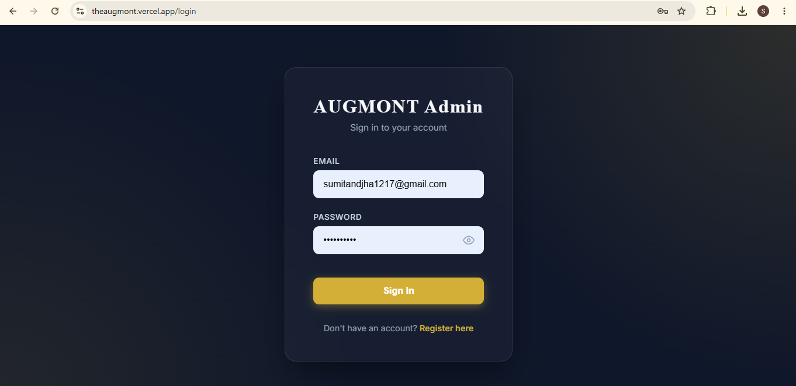
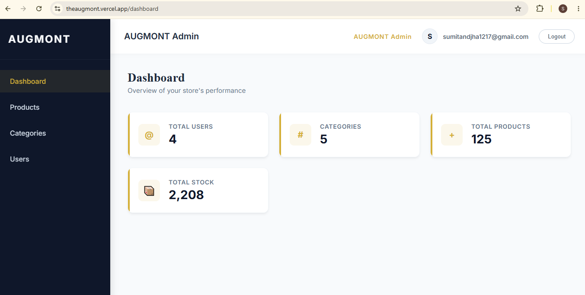
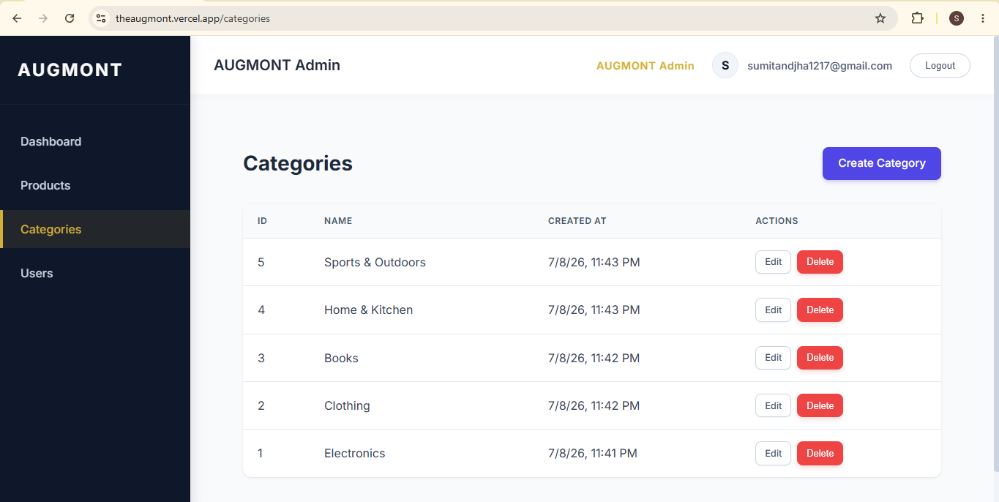
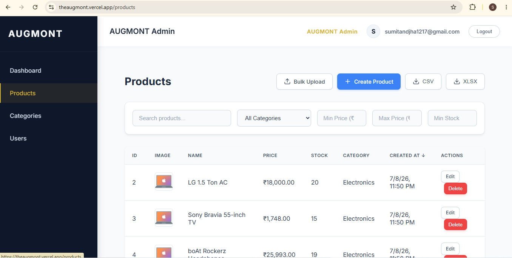
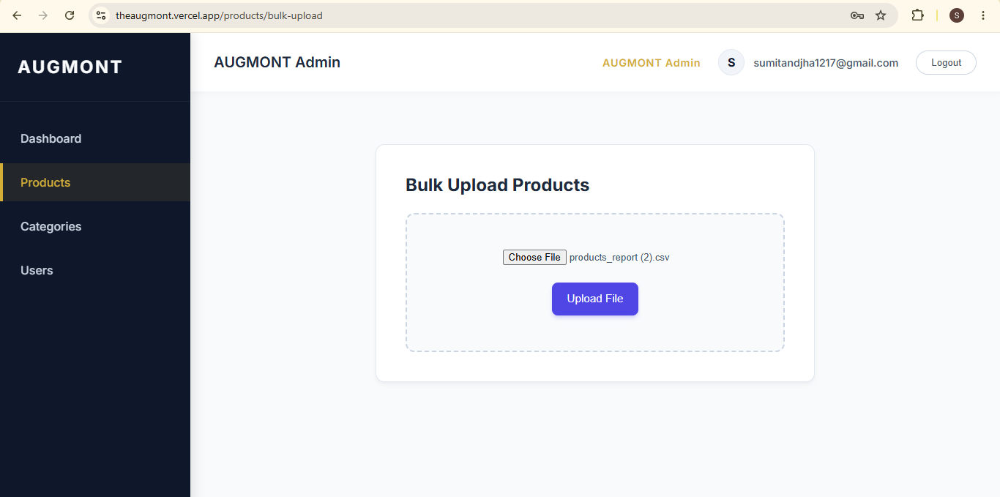
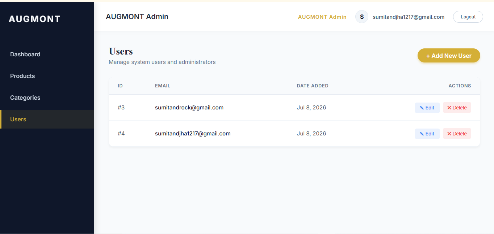

# Angular CRUD System — Full Stack Assessment

A full-stack CRUD application built with Angular 18 (standalone components, reactive forms) and a Node.js/Express backend on PostgreSQL (Sequelize ORM).

## Live Demo

- **Frontend:**  https://theaugmont.vercel.app
- **Backend API:** http://15.207.84.178:3000/api

## Screenshots

## Project Structure

- `/frontend` — Angular 18 application (standalone components, TypeScript)
- `/backend` — Node.js Express API (plain JavaScript)
- `augmont_postman_collection.json` — Postman collection for API testing

## Design Decisions

1. **Angular v18, not v22** — v18 has years of community troubleshooting history; v22 (released weeks before this project started) has minimal tutorial coverage, a real liability on a fixed deadline.
2. **Sequelize, not Prisma** — plain `define()` API, chosen for wider documentation coverage on relational modeling for a first-time relational-DB project.
3. **PostgreSQL, not MySQL** — both were acceptable per the assignment spec; Postgres was chosen specifically for native `pg-query-stream` cursor support, needed for the streaming report requirement below.
4. **Dual data-access strategy** — Sequelize handles all standard CRUD. The report endpoint bypasses it entirely in favor of raw `pg` + `pg-query-stream`, since Sequelize loads full result sets into memory and cannot stream — this keeps report generation at O(1) memory regardless of table size.
5. **Async bulk upload** — the upload endpoint returns `202 Accepted` with a job ID immediately instead of blocking the HTTP response while parsing. Processing happens in the background; the frontend polls a status endpoint (RxJS `switchMap` + `takeWhile`) until completion. This avoids 504 timeouts on large files.
6. **Server-side pagination, sort, and search** — implemented as real `LIMIT/OFFSET` SQL, not fetched-then-sliced on the frontend, to stay performant at scale.

## Environment Variables

Create a `.env` file in `/backend` with:

| Variable | Description |
|---|---|
| `PORT` | Backend server port (default 3000) |
| `NODE_ENV` | `development` or `production` |
| `CORS_ORIGIN` | Allowed frontend origin |
| `DB_HOST` | PostgreSQL host |
| `DB_PORT` | PostgreSQL port (default 5432) |
| `DB_NAME` | Database name |
| `DB_USER` | Database user |
| `DB_PASSWORD` | Database password |
| `JWT_SECRET` | Secret key for signing JWTs |
| `JWT_EXPIRES_IN` | Token expiry (e.g. `24h`) |

## Setup Instructions

### 1. Clone and install
\`\`\`bash
git clone https://github.com/sumit0721/augmont.git
cd augmont
npm run install:all
\`\`\`

### 2. Configure environment
Copy `backend/.env.example` to `backend/.env` and fill in your values.

### 3. Run with Docker (recommended)
\`\`\`bash
docker compose up --build
\`\`\`
This starts PostgreSQL, the backend, and the frontend together.

### 4. Or run manually
\`\`\`bash
npm run dev
\`\`\`
- Backend: http://localhost:3000
- Frontend: http://localhost:4200

### 5. Run backend tests
\`\`\`bash
cd backend
npm test
\`\`\`

## Features

- **Auth:** JWT-based registration and login, bcrypt-hashed passwords
- **Users:** Full CRUD
- **Categories:** Full CRUD — deletion blocked if products are attached
- **Products:** Full CRUD with image upload (multer)
- **Bulk Upload:** Async CSV/XLSX upload with background processing and live polling — avoids 504 timeouts
- **Reports:** Streamed CSV and XLSX generation, O(1) memory — avoids 504 timeouts
- **Product List:** Server-side pagination, price sorting, name/category search

## API Endpoints

| Method | Endpoint | Purpose |
|---|---|---|
| POST | `/api/auth/register` | Register |
| POST | `/api/auth/login` | Login |
| GET/POST/PUT/DELETE | `/api/users(/:id)` | User CRUD |
| GET/POST/PUT/DELETE | `/api/categories(/:id)` | Category CRUD |
| GET/POST/PUT/DELETE | `/api/products(/:id)` | Product CRUD |
| POST | `/api/products/bulk-upload` | Async bulk upload |
| GET | `/api/products/bulk-upload/status/:jobId` | Upload status |
| GET | `/api/products/report?format=csv\|xlsx` | Streamed report |

## API Testing (Postman)

Import `augmont_postman_collection.json` into Postman. Two environments are included — **Augmont Local** and **Augmont Production** — switch between them via the environment dropdown. Run **Register** or **Login** first; the auth token auto-saves for all protected requests.